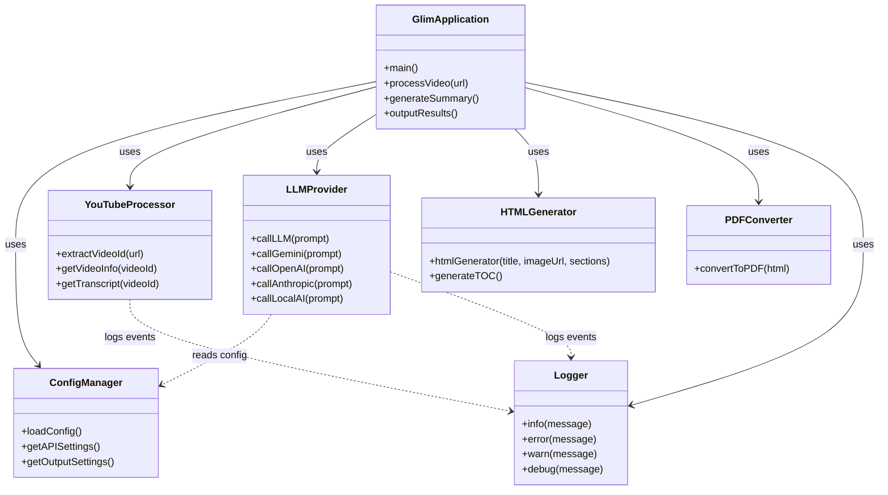
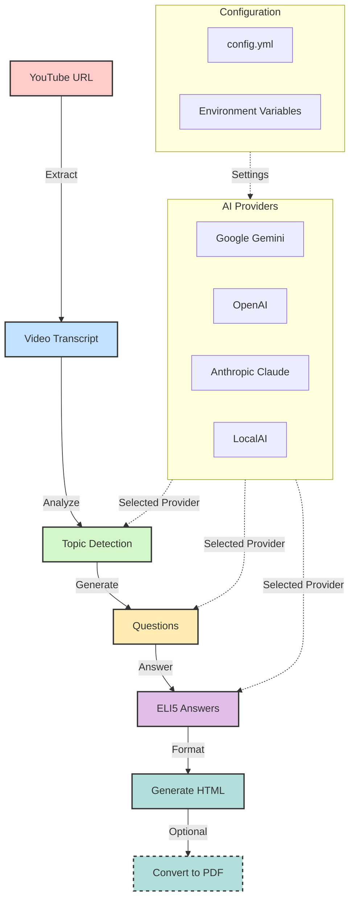
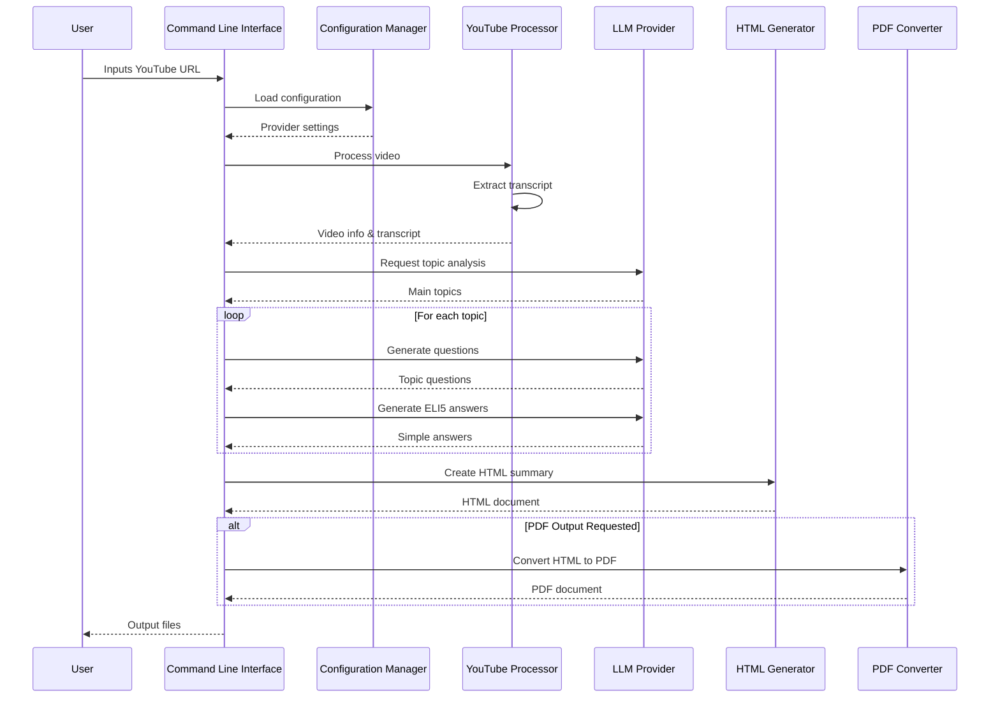

# Glim - YouTube Video Summarizer


<div align="center">
  
  <br/>
  
</div>


A powerful Node.js application that transforms YouTube videos into well-organized, easy-to-understand summaries. Glim processes videos to extract main topics, generate thought-provoking questions, and provide simple ELI5 (Explain Like I'm 5) answers in a beautifully formatted HTML document.
## Features

- Extract transcript from YouTube videos
- Identify main topics from the video content
- Generate thought-provoking questions for each topic
- Create simple, easy-to-understand answers using HTML formatting
- Generate a well-formatted HTML output file
- PDF export capability for easy sharing and printing
- Configurable AI provider settings
- Built on the PocketFlow framework for modular processing

## Prerequisites

- Node.js (v16 or higher)
- API key for your preferred AI provider (Google Gemini by default)

## Installation

1. Clone the repository
2. Install dependencies:

```bash
npm install
```

## Usage

### Basic Usage

Run the application with your API key and provide a YouTube URL:

```bash
GOOGLE_API_KEY="your-api-key" node src/index.js --url "https://www.youtube.com/watch?v=VIDEO_ID"
```

Or run it and enter the URL when prompted:

```bash
GOOGLE_API_KEY="your-api-key" node src/index.js
```

### Additional Options

Create a default configuration file:

```bash
node src/index.js --config
```

Generate a PDF version of the output:

```bash
node src/index.js --url "https://www.youtube.com/watch?v=VIDEO_ID" --pdf
```

### Processing Steps

When you run Glim, it will:

1. Extract the video transcript
2. Identify the main topics
3. Generate questions for each topic
4. Create simple ELI5 answers
5. Generate an HTML output file (and optionally PDF)

## Configuration

Glim can be configured via a YAML configuration file. Create a default config with:

```bash
node src/index.js --config
```

This will create a `config.yml` file with the following structure:

```yaml
api:
    provider: google # Options: google, openai, anthropic, localai
    key: # Your API key for the chosen provider
    model: gemini-2.0-flash
    temperature: 0.7 # Controls randomness in responses (0.0-1.0)
    max_tokens: 4000 # Maximum tokens in response
    endpoint: http://localhost:11434/api/generate # For localai provider only
content:
    maxTopics: 5
    maxQuestionsPerTopic: 3
    codeLang: en
output:
    filename: output.html
```

### Changing AI Provider

Glim now supports multiple AI providers. You can configure your preferred provider in the `config.yml` file:

#### Google Gemini

```yaml
api:
    provider: google
    key: your-api-key
    model: gemini-2.0-flash
```

1. Obtain a Google API key from [Google AI Studio](https://makersuite.google.com/)
2. Set it in your environment variables: `export GOOGLE_API_KEY="your-api-key"`
3. Or update the `key` field in your `config.yml` file

#### OpenAI

```yaml
api:
    provider: openai
    key: your-api-key
    model: gpt-4o
    temperature: 0.7
```

1. Install the OpenAI package: `npm install openai`
2. Obtain an API key from [OpenAI Platform](https://platform.openai.com/)
3. Set it in your environment variables: `export OPENAI_API_KEY="your-api-key"`
4. Or update the `key` field in your `config.yml` file

#### Anthropic Claude

```yaml
api:
    provider: anthropic
    key: your-api-key
    model: claude-3-sonnet-20240229
    max_tokens: 4000
```

1. Install the Anthropic package: `npm install @anthropic-ai/sdk`
2. Obtain an API key from [Anthropic Console](https://console.anthropic.com/)
3. Set it in your environment variables: `export ANTHROPIC_API_KEY="your-api-key"`
4. Or update the `key` field in your `config.yml` file

#### Local LLM (Ollama, LocalAI, etc.)

```yaml
api:
    provider: localai
    model: llama3
    endpoint: http://localhost:11434/api/generate
    temperature: 0.7
    max_tokens: 2000
```

1. Set up and run a local LLM server like [Ollama](https://ollama.ai/) or [LocalAI](https://github.com/go-skynet/LocalAI)
2. Configure the endpoint URL in your `config.yml` file

You can easily extend Glim with additional AI providers by modifying the `callLLM.js` file.

### Customizing Content Generation

You can adjust the following parameters in your `config.yml`:

- `maxTopics`: Maximum number of topics to extract (default: 5)
- `maxQuestionsPerTopic`: Maximum questions per topic (default: 3)
- `codeLang`: Language code for transcript extraction (default: 'en')

### Output Customization

- `filename`: Name of the output HTML file (default: 'output.html')
- Use the `--pdf` flag to also generate a PDF version

## Project Structure

- `src/index.js` - Main application entry point
- `src/flow.js` - Flow creation and orchestration using PocketFlow
- `src/pocketflow.js` - PocketFlow framework integration
- `src/nodes.js` - Processing nodes for the video summarization pipeline
- `src/utils/` - Utility functions:
    - `callLLM.js` - Multi-provider LLM API interaction
    - `youtubeProcessor.js` - YouTube video processing
    - `htmlGenerator.js` - HTML output generation
    - `logger.js` - Enhanced logging functionality
    - `pdfConvertor.js` - PDF conversion utilities

### Component Architecture

The following diagram illustrates the components and their relationships in the Glim application:



### How Glim Uses PocketFlow

Glim implements a video summarization pipeline using PocketFlow's node-based architecture:

<div align="center">
  
</div>

#### Workflow Diagram



#### Processing Nodes

1. **Input Node**: Handles YouTube URL validation and processing
2. **Extraction Node**: Extracts video transcript using YouTube API
3. **Analysis Node**: Sends content to the selected LLM provider for topic extraction
4. **Question Generation Node**: Creates questions for each identified topic
5. **Answer Generation Node**: Produces ELI5 answers for each question
6. **Output Node**: Formats results into HTML/PDF using templates

This modular approach makes it easy to:

- Swap LLM providers without changing the overall flow
- Add new processing steps (e.g., translation, keyword extraction)
- Customize output formats while reusing the core processing logic

#### Sequence Diagram

The following diagram illustrates the execution sequence and data flow between components:



## About PocketFlow Framework

<div align="center">
  
</div>

Glim is built on the PocketFlow framework, a minimalist 100-line LLM framework designed for building modular, efficient processing flows. PocketFlow provides:

- **Lightweight Architecture**: Just 100 lines of core code with zero dependencies and no vendor lock-in
- **Flexible Graph-Based Processing**: Build complex data processing workflows with simple, reusable nodes
- **Rich Design Patterns**: Support for Agents, Multi-Agent Systems, Workflows, RAG (Retrieval Augmented Generation), and more
- **Error Handling**: Built-in error management and automatic retries
- **Extensibility**: Easy to customize and extend with your own processing nodes

PocketFlow's minimalist approach perfectly complements Glim's video summarization pipeline, allowing for:

- Modular processing of YouTube video content
- Flexible integration of multiple LLM providers
- Easy extension for new features and output formats

Learn more about the PocketFlow framework at:
[https://github.com/The-Pocket/PocketFlow](https://github.com/The-Pocket/PocketFlow)

## Development

Want to modify or extend Glim? Here's how to set up your development environment:

1. Clone the repository:

    ```bash
    git clone https://github.com/yourusername/glim.git
    cd glim
    ```

2. Install dependencies:

    ```bash
    npm install
    ```

3. Create a config file with your API key:

    ```bash
    node src/index.js --config
    ```

    Then edit the `config.yml` file to add your API key.

4. Make your changes to the codebase.

5. Test your changes:

    ```bash
    GOOGLE_API_KEY="your-api-key" node src/index.js --url "https://www.youtube.com/watch?v=VIDEO_ID"
    ```

### Adding a New AI Provider

To add support for a different AI model or provider:

1. Create a new file in `src/utils/` for your provider, for example `openAIProvider.js`.
2. Implement the API call function similar to the existing `callLLM.js`.
3. Update the `config.js` file to include your new provider in the options.
4. Modify the code in the nodes that call the LLM to use your new provider when selected.

## Troubleshooting

### API Key Issues

- **Error**: "API key not found"
    - **Solution**: Make sure your API key is set in the environment variable or in the config.yml file.

### YouTube Video Access

- **Error**: "Could not extract video transcript"
    - **Solution**: Make sure the video is public and has captions/subtitles available.

### PDF Generation

- **Error**: "Failed to write output file as pdf"
    - **Solution**: Ensure you have Puppeteer installed correctly and enough system resources.


## License

[MIT](./LICENSE)

---

<div align="center">
  <p>Made with ❤️ by Bagi</p>
  
</div>
