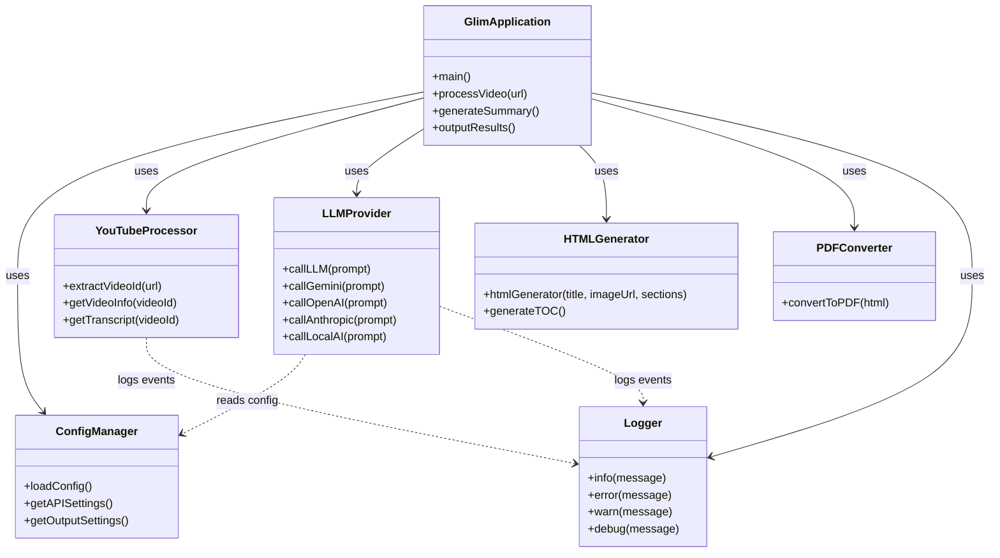

```mermaid
classDiagram
    class GlimApplication {
        +main()
        +processVideo(url)
        +generateSummary()
        +outputResults()
    }
    
    class ConfigManager {
        +loadConfig()
        +getAPISettings()
        +getOutputSettings()
    }
    
    class YouTubeProcessor {
        +extractVideoId(url)
        +getVideoInfo(videoId)
        +getTranscript(videoId)
    }
    
    class LLMProvider {
        +callLLM(prompt)
        +callGemini(prompt)
        +callOpenAI(prompt)
        +callAnthropic(prompt)
        +callLocalAI(prompt)
    }
    
    class HTMLGenerator {
        +htmlGenerator(title, imageUrl, sections)
        +generateTOC()
    }
    
    class PDFConverter {
        +convertToPDF(html)
    }
    
    class Logger {
        +info(message)
        +error(message)
        +warn(message)
        +debug(message)
    }
    
    GlimApplication --> ConfigManager : uses
    GlimApplication --> YouTubeProcessor : uses
    GlimApplication --> LLMProvider : uses
    GlimApplication --> HTMLGenerator : uses
    GlimApplication --> PDFConverter : uses
    GlimApplication --> Logger : uses
    
    LLMProvider ..> ConfigManager : reads config
    YouTubeProcessor ..> Logger : logs events
    LLMProvider ..> Logger : logs events
```
