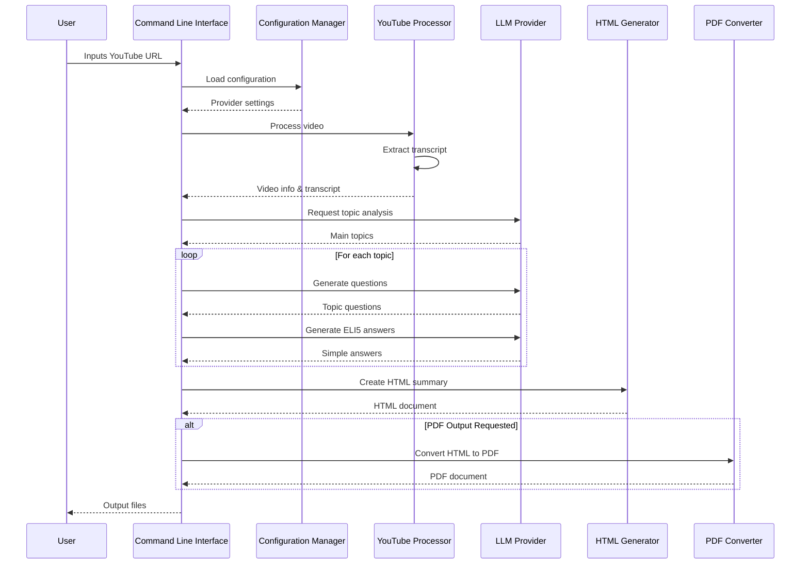

```mermaid
sequenceDiagram
    participant User
    participant CLI as Command Line Interface
    participant Config as Configuration Manager
    participant YT as YouTube Processor
    participant LLM as LLM Provider
    participant Generator as HTML Generator
    participant PDF as PDF Converter

    User->>CLI: Inputs YouTube URL
    CLI->>Config: Load configuration
    Config-->>CLI: Provider settings
    CLI->>YT: Process video
    YT->>YT: Extract transcript
    YT-->>CLI: Video info & transcript
    CLI->>LLM: Request topic analysis
    LLM-->>CLI: Main topics
    
    loop For each topic
        CLI->>LLM: Generate questions
        LLM-->>CLI: Topic questions
        CLI->>LLM: Generate ELI5 answers
        LLM-->>CLI: Simple answers
    end
    
    CLI->>Generator: Create HTML summary
    Generator-->>CLI: HTML document
    
    alt PDF Output Requested
        CLI->>PDF: Convert HTML to PDF
        PDF-->>CLI: PDF document
    end
    
    CLI-->>User: Output files
```
